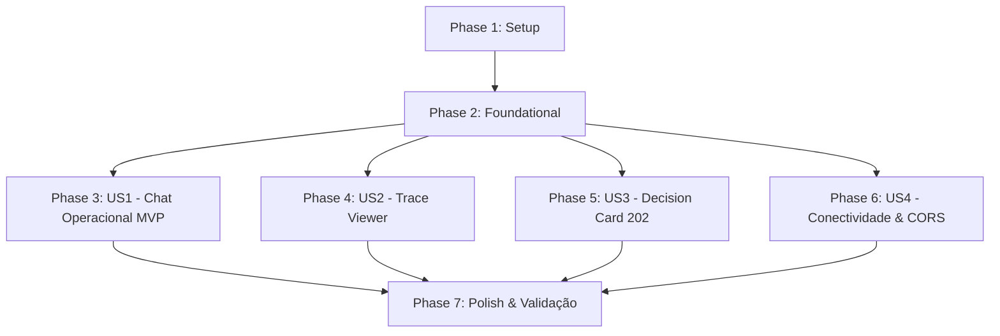

# Tasks: War Room Web OpssPilot

**Feature**: `013-war-room-web` | **Branch**: `013-war-room-web`  
**Spec**: [spec.md](./spec.md) | **Plan**: [plan.md](./plan.md)

---

## Phase 1: Setup (Shared Infrastructure)

**Purpose**: Inicialização do projeto frontend `web/` com Vite, React, TypeScript e integração de scripts no repositório.

- [X] T001 Inicializar estrutura de diretórios e arquivos base do frontend em `web/package.json` com dependências `react`, `react-dom`, `zod`, e devDependencies `vite`, `@vitejs/plugin-react`, `typescript`, `@types/react`, `@types/react-dom`
- [X] T002 [P] Configurar TypeScript estrito para o frontend em `web/tsconfig.json` e `web/tsconfig.node.json` com `strict: true`, `target: ES2022`, `moduleResolution: bundler` e suporte a JSX
- [X] T003 [P] Configurar bundler Vite com base `/opsspilot/` e porta padrão 5173 em `web/vite.config.ts`
- [X] T004 [P] Criar página HTML inicial com acessibilidade, título e viewport em `web/index.html`
- [X] T005 Adicionar scripts no `package.json` raiz (`web:dev`, `web:build`, `web:preview`) para orquestrar o frontend

---

## Phase 2: Foundational (Blocking Prerequisites)

**Purpose**: Infraestrutura crítica e tokens fundamentais requeridos por todas as histórias de usuário.

**⚠️ CRITICAL**: Nenhuma história de usuário deve ser iniciada antes da conclusão desta fase.

- [X] T006 Implementar tokens de design em `web/src/styles/tokens.css` contendo escala geométrica de 4px/8px (`--space-1` a `--space-12`), paleta Dark-First (`--bg-primary: #0b0f19`, `--bg-surface: #111827`, `--bg-overlay: #1f2937`), cores semânticas e sombras
- [X] T007 [P] Implementar estilos globais e regras de acessibilidade em `web/src/styles/global.css` com `:focus-visible`, resets, tipografia e suporte a `prefers-reduced-motion`
- [X] T008 [P] Definir tipos TypeScript e schemas Zod para mensagens, eventos de trace e configurações em `web/src/types/chat.ts` conforme `data-model.md`
- [X] T009 [P] Implementar módulo de persistência local para URL da API e tema em `web/src/services/storage.ts` com fallback para `http://localhost:3000` e tema `dark`
- [X] T010 [P] Implementar middleware nativo de CORS no backend Express em `src/http/server.ts` habilitando métodos `GET, POST, OPTIONS` e cabeçalhos `Content-Type, X-Request-Id, Authorization`
- [X] T011 Implementar cliente HTTP centralizado em `web/src/services/api.ts` com validação Zod, timeout configurável e tratamento seguro de erros de rede e CORS

**Checkpoint**: Fundação pronta - componentes e telas podem ser implementados e testados de forma independente.

---

## Phase 3: User Story 1 - Chat Operacional em Tempo Real (Priority: P1) 🎯 MVP

**Goal**: Permitir que operadores enviem mensagens e recebam respostas do OpssPilot em tempo real com histórico e feedback visual.

**Independent Test**: Acessar `http://localhost:5173/opsspilot/`, enviar `"abra um low no auth"`, visualizar a resposta do assistente e enviar nova mensagem verificando a preservação do `conversationId`.

### Implementation for User Story 1

- [X] T012 [P] [US1] Criar componente de mensagem individual em `web/src/components/ChatMessage.tsx` com diferenciação visual entre operador e copiloto, timestamp formatado e suporte a markdown básico
- [X] T013 [P] [US1] Criar componente de entrada de mensagem em `web/src/components/ChatInput.tsx` com campo de texto expansível, envio via `Enter` (com `Shift+Enter` para quebra de linha), botão com ícone de envio e desabilitação durante processamento
- [X] T014 [US1] Criar componente de lista de mensagens em `web/src/components/ChatFeed.tsx` com rolagem automática para a última mensagem e empty state amigável contendo ícone e sugestões de comandos de plantão
- [X] T015 [US1] Orquestrar estado da conversa, envio de requisição e persistência de histórico em `web/src/App.tsx`
- [X] T016 [US1] Criar ponto de entrada React em `web/src/main.tsx` montando a aplicação sob a rota base `/opsspilot/`

**Checkpoint**: MVP do War Room funcional, permitindo diálogo contínuo com o copiloto via `/chat`.

---

## Phase 4: User Story 2 - Inspeção de Raciocínio Operacional (Trace Viewer) (Priority: P2)

**Goal**: Disponibilizar botão "Ver Raciocínio" para inspecionar os passos do grafo do agente em um painel lateral retrátil.

**Independent Test**: Clicar em "Ver Raciocínio" em qualquer mensagem do assistente e validar a exibição ordenada dos nós (`route`, `action`, `observation`, `thought`, `fallback`) com argumentos JSON inspecionáveis.

### Implementation for User Story 2

- [X] T017 [P] [US2] Implementar subcomponentes visuais para cada nó do trace em `web/src/components/trace/TraceStepItem.tsx` com ícones, cores semânticas e formatação de JSON expansível para argumentos e payloads
- [X] T018 [US2] Implementar componente de painel lateral retrátil em `web/src/components/TraceDrawer.tsx` com cabeçalho de métricas (tempo, tokens, chamadas de IA), botão de fechar acessível via tecla `Escape` e trava de foco
- [X] T019 [US2] Integrar o botão "Ver Raciocínio" no componente `web/src/components/ChatMessage.tsx` exibindo badge com quantidade de passos e disparando abertura do `TraceDrawer`
- [X] T020 [US2] Conectar o estado do `TraceDrawer` ativo no componente principal `web/src/App.tsx`

**Checkpoint**: Transparência e explicabilidade total do raciocínio operacional disponibilizadas para os engenheiros de plantão.

---

## Phase 5: User Story 3 - Cartão de Decisão Human-in-the-Loop (Status 202) (Priority: P3)

**Goal**: Transformar respostas HTTP 202 em cartões de aprovação/rejeição para ações sensíveis de infraestrutura.

**Independent Test**: Disparar resposta com código 202 contendo ação pendente, verificar o render do `DecisionCard` com botões "Aprovar" e "Negar", e conferir o envio da decisão e bloqueio de cliques repetidos.

### Implementation for User Story 3

- [X] T021 [P] [US3] Implementar suporte ao status HTTP 202 no cliente de API `web/src/services/api.ts` retornando estrutura de `pendingAction`
- [X] T022 [US3] Implementar componente de cartão de decisão em `web/src/components/DecisionCard.tsx` com destaque visual de segurança, resumo da ação, parâmetros operacionais e botões "Aprovar" e "Negar"
- [X] T023 [US3] Conectar o `DecisionCard` no fluxo de mensagens de `web/src/components/ChatMessage.tsx` e `web/src/App.tsx`, disparando envio da decisão do operador para a conversa e atualizando o status do cartão para "Aprovado" ou "Negado"

**Checkpoint**: Fluxo de governança e segurança Human-in-the-loop operacional na interface.

---

## Phase 6: User Story 4 - Conectividade Configurável, Rota Base e CORS (Priority: P4)

**Goal**: Permitir configuração dinâmica da URL da API via ícone de engrenagem, testar conexão e garantir funcionamento com CORS e base `/opsspilot/`.

**Independent Test**: Clicar na engrenagem no cabeçalho, alterar a URL da API para `http://localhost:3000`, testar conectividade (`/health`), salvar e validar que a configuração persiste após recarregar.

### Implementation for User Story 4

- [X] T024 [P] [US4] Implementar componente de cabeçalho em `web/src/components/Header.tsx` exibindo título "OpssPilot War Room", badge de status da API (Online/Offline), alternador de tema Dark/Light e botão com ícone de engrenagem
- [X] T025 [US4] Implementar modal de configurações em `web/src/components/SettingsModal.tsx` com campo para URL base da API, validação de URL, botão "Testar Conexão" (chamando `/health`), feedback visual de latência e persistência no `localStorage`
- [X] T026 [US4] Adicionar testes automatizados de CORS e preflight OPTIONS para o backend Express em `test/cors.test.ts`
- [X] T027 [US4] Integrar `Header` e `SettingsModal` com gerenciamento de conectividade em `web/src/App.tsx`

**Checkpoint**: Conectividade configurável, multi-ambiente e suporte a CORS totalmente operacionais.

---

## Phase 7: Polish & Cross-Cutting Concerns

**Purpose**: Refinamentos finais, validação de acessibilidade e empacotamento para produção.

- [X] T028 [P] Adicionar indicador visual de digitação e skeleton loaders para mensagens em `web/src/components/ChatFeed.tsx`
- [X] T029 Validar acessibilidade por teclado em todos os modais, botões e drawers com `:focus-visible` ativo e contraste WCAG 2.1 AA
- [X] T030 Validar build estático de produção executando `npm run web:build` e checando a geração de bundles em `web/dist/` sob a base `/opsspilot/`
- [X] T031 Executar suíte de testes do projeto (`npm test` e `npm run typecheck`) garantindo 0 regressões

---

## Dependencies & Execution Order

