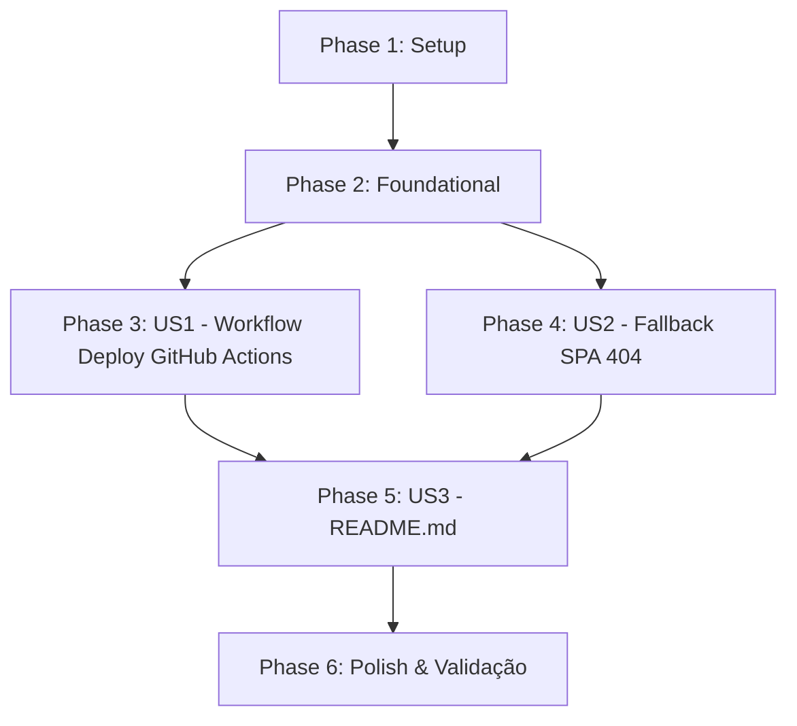

# Tasks: Deploy do War Room Web no GitHub Pages via Actions

**Feature**: `014-deploy-web-pages` | **Branch**: `014-deploy-web-pages`  
**Spec**: [spec.md](./spec.md) | **Plan**: [plan.md](./plan.md)

---

## Phase 1: Setup (Shared Infrastructure)

**Purpose**: Criação da estrutura de diretórios para workflows do GitHub Actions.

- [X] T001 Criar diretório para workflows em `.github/workflows`

---

## Phase 2: Foundational (Blocking Prerequisites)

**Purpose**: Pré-requisitos de build e automação necessários para o pipeline de publicação.

**⚠️ CRITICAL**: Nenhuma tarefa de deploy pode ser concluída sem a garantia do build estático correto.

- [X] T002 Validar que o comando `npm run web:build` no `package.json` gera a pasta `web/dist/` com todos os bundles estáticos sob a base `/opsspilot/`
- [X] T003 [P] Adicionar script `web:build` com etapa de geração de fallback SPA `web/dist/404.html` no `package.json` raiz ou no `web/package.json`

**Checkpoint**: Base estática pronta para ser empacotada pelo GitHub Actions.

---

## Phase 3: User Story 1 - Publicação Contínua no GitHub Pages via GitHub Actions (Priority: P1) 🎯 MVP

**Goal**: Automatizar o build e deploy do frontend `web/` no GitHub Pages através do workflow `deploy-pages.yml`.

**Independent Test**: Simular ou disparar o workflow no GitHub Actions e verificar a conclusão com sucesso das etapas de upload (`upload-pages-artifact`) e deploy (`deploy-pages`).

### Implementation for User Story 1

- [X] T004 [US1] Criar workflow de CI/CD em `.github/workflows/deploy-pages.yml` com triggers em `push` para a branch `main` (filtrando caminhos `web/**`, `package*.json`, `.github/workflows/**`) e `workflow_dispatch`
- [X] T005 [US1] Configurar permissões de segurança OIDC (`contents: read`, `pages: write`, `id-token: write`) e concorrência (`group: "pages"`, `cancel-in-progress: false`) em `.github/workflows/deploy-pages.yml`
- [X] T006 [US1] Implementar job de build no workflow `.github/workflows/deploy-pages.yml` utilizando Node.js 22 LTS, cache de dependências e ação `actions/upload-pages-artifact@v3` apontando para `web/dist`
- [X] T007 [US1] Implementar job de deploy no workflow `.github/workflows/deploy-pages.yml` associado ao environment `github-pages` utilizando a ação `actions/deploy-pages@v4`

**Checkpoint**: Pipeline de CI/CD do GitHub Pages totalmente implementado e configurado para execução automática.

---

## Phase 4: User Story 2 - Roteamento Estático sob Base `/opsspilot/` e Fallback SPA (Priority: P2)

**Goal**: Garantir que recarregamentos de página e rotas diretas não gerem erro 404 no GitHub Pages.

**Independent Test**: Verificar a existência do arquivo `404.html` idêntico a `index.html` em `web/dist/` após o build.

### Implementation for User Story 2

- [X] T008 [US2] Adicionar comando de cópia de fallback `cp web/dist/index.html web/dist/404.html` no script de build do `web/package.json` e no workflow `.github/workflows/deploy-pages.yml`
- [X] T009 [P] [US2] Validar integridade dos caminhos de assets em `web/dist/index.html` e `web/dist/404.html` garantindo compatibilidade com o subpath `/opsspilot/`

**Checkpoint**: Roteamento SPA protegido contra erros 404 do GitHub Pages.

---

## Phase 5: User Story 3 - Documentação do War Room e Instruções de Uso no README (Priority: P3)

**Goal**: Fornecer documentação completa e amigável no `README.md` com link público do Pages e instruções para conectar a API.

**Independent Test**: Ler o `README.md` e verificar seções claras sobre o War Room, o link do Pages e o passo a passo para conectar com a API local (`http://localhost:3000`) via engrenagem.

### Implementation for User Story 3

- [X] T010 [US3] Criar o arquivo `README.md` na raiz do projeto com visão geral do OpssPilot, stack tecnológica e badges de status
- [X] T011 [US3] Adicionar seção dedicada ao **War Room Web** no `README.md` contendo o link de acesso no GitHub Pages (`https://<user>.github.io/opss-pilot/`)
- [X] T012 [P] [US3] Adicionar guia passo a passo no `README.md` orientando o usuário a configurar a URL da API backend via menu de engrenagem (⚙️), incluindo informações de CORS e execução local

**Checkpoint**: Documentação completa e acessível para novos usuários e colaboradores.

---

## Phase 6: Polish & Cross-Cutting Concerns

**Purpose**: Validações estáticas de sintaxe e testes de regressão.

- [X] T013 Validar sintaxe do arquivo de workflow YAML `.github/workflows/deploy-pages.yml`
- [X] T014 Executar teste completo de build estático com `npm run web:build` conferindo geração de `index.html` e `404.html` em `web/dist/`
- [X] T015 Executar suíte de testes existente do projeto (`npm test` e `npm run typecheck`) garantindo zero regressões no backend

---

## Dependencies & Execution Order

### Story Completion Order

1. **Setup & Foundational (Phases 1 & 2)**: Prepara ambiente de CI/CD e scripts.
2. **User Story 1 (P1)**: Criação do pipeline de deploy do GitHub Pages (`deploy-pages.yml`).
3. **User Story 2 (P2)**: Garantia de fallback SPA `404.html`.
4. **User Story 3 (P3)**: Criação e atualização do `README.md` com instruções.
5. **Polish (Phase 6)**: Validações estáticas e suíte de testes.

---

## Parallel Execution Opportunities

- `T003` (script de build) e `T005` (permissões do workflow) podem ser preparados em paralelo.
- `T009` (validação de assets) e `T012` (guia de conexão no README) podem ser executados em paralelo.

---

## Implementation Strategy

### MVP First (Phases 1, 2 e 3)
1. Criar `.github/workflows/deploy-pages.yml` com upload e deploy do Pages.
2. Adicionar fallback `404.html`.
3. Criar `README.md` completo com instruções e links.
4. Validar build e testes.
